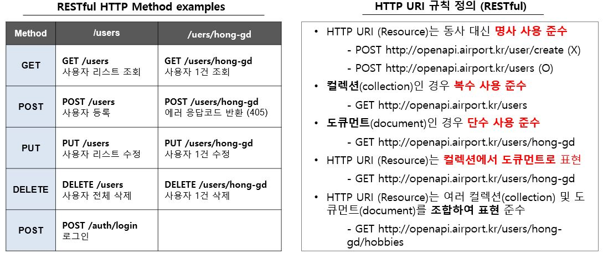

# 해외법인운영관리시스템(LGLGMS) Back-End

#### 관리자 이외에 build.gradle, application*.yml 업로드 하지 말것

## 1. 프로젝트구조
```sh
lgl-gms-webapi
    ├─src
    │   └─main
    │      ├─java
    │      │   ├─com.lgl.gms
    │      │   │   ├─batch
    │      │   │   ├─config
    │      │   │   └─webapi
    │      │   │   │   ├─업무구분명1
    │      │   │   │   │   ├─contoller
    │      │   │   │   │   ├─dto
    │      │   │   │   │   │  ├─request
    │      │   │   │   │   │  └─response
    │      │   │   │   │   ├─persistence
    │      │   │   │   │   │  ├─dao
    │      │   │   │   │   │  └─model
    │      │   │   │   │   └─service
    │      │   │   │   ├─업무구분2
    │      │   │   │   │   ├─contoller
    │      │   │   │   │   ├─dto
    │      │   │   │   │   │  ├─request
    │      │   │   │   │   │  └─response
    │      │   │   │   │   ├─persistence
    │      │   │   │   │   │  ├─dao
    │      │   │   │   │   │  └─model
    │      │   │   │   │   └─service
    │      │   │   │   └─sample
    │      │   │   │       ├─contoller
    │      │   │   │       ├─dto
    │      │   │   │       │  ├─request
    │      │   │   │       │  └─response
    │      │   │   │       ├─persistence
    │      │   │   │       │  ├─dao
    │      │   │   │       │  └─model
    │      │   │   │       └─service
    │      │   │   └─**Application.java    
    │      └─resources
    │          ├─i18n
    │          ├─mappers
    │          │   └─메뉴명1
    │          │   └─메뉴명2...
    │          ├─application*.yml
    │          └─logback.xml
    │           
    │   
    ├─.gitignore
    ├─....
    ├─README.md
    ├─build.gradle
    └─settings.gradle
```

## 2. RESTful api 구현 
### 1) REST(Representational State Transfer) API(Application Programing Interface)
** 시스템의 모든 interface는 REST API를 기본으로 한다**

- REST 란
  - www와 같은 분산 하이퍼미디어 시스템을 위한 소프트웨어 개발 아키텍처의 한 형식
    (웹의 장점을 최대한 활용할 수 있는 아키텍처 스타일)
  - 데이터가 요청되는 시점의 자원의 상태(정보)를 전달 (자원:문서,그림,데이터,SW 등)
  - 다양한 클라이언트가 등장, 멀티플랫폼에 대한 아키텍처에 적합
    (http표준 프로토콜에 따르는 모든 플랫폼에서 사용가능)
  - 어플리케이션 분리, 통합에 유리
  
- REST 특징
  - Uniform interface : uri로 리소스 조작을 통일되고 한정적인 인터페이스로 수행
  - Stateless : 작업을 위한 상태정보를 저장하거나 관리하지 않음 (세션/쿠키 정보를 별도로 저장, 관리하지않음)
  - Cacheable : 캐시 가능, http 표준의 Last-Modified, E-tag 등 캐싱구현 가능
  - Self-descriptiveness : REST API 메시지만 보고도 쉽게 이해할 수 있는 표현구조로 되어있음
  - Client-server : 서버는 API 제공, 클라이언트는 사용자 인증, 컨텍스트등을 직접 관리하는 구조
  - 계층형 구조 : 네트워크 레이어구조와 같이 다중계층 구성가능, 로드밸런싱, 암호화, PROXY, 게이트웨이같은 중간 계층을 둘 수 있음
  
- REST 3요소
  - resource(자원) : URI -> 어떤 자원인지 URI로 표현한다. (명사사용, 동사X)
  - verb(행위) : HTTP METHOD -> 어떤 행위인지 HTTP Methoed(GET, POST, PUT, DELETE)로 표현한다.
  - Representations(표현) : 요청한 자원에 대한 응답

- URI (RFC3986)
  - /는 계층구분
  - 마지막엔 /를 붙이지 않음
  - 밑줄(_)은 사용하지 않으며, 가독성을 높이기 위해서는 하이푼(-) 사용
  - 소문자만 사용
  - 파일 확장자를 붙이지 않음(accept header에 사용하도록)

- http method
  - post : 리소스 생성
  - get : 리소스 조회
  - put : 리소스 수정
  - delete : 리소스 삭제
  - 그외 : post (로그인 처리 등)

- restful http method 및 uri 규칙    

    
  
- requst, response payload 규칙
  - request, response 모두 body에 json type으로 데이터 구성 (Content-Type : application/json)
  - ** 단, get request는 query string을 사용(브라우저마다 다르나 2000자 이내로 사용권장)**
  
    
  
  - client와 주고받는 데이터 객체는 dto, service-persistence layer간 데이터 객체는 model에 생성한다.
  - ** 단, select문의 결과는 HashMap을 사용한다.

### 2) Presentation Layer (controller 생성, dto 생성)
** API를 정의하며 client와 service layer간 메시지 교환 역할만 수행**
- response는 BaseResponse 객체를 최종 객체로 사용한다!
  즉, 각 업무기능별 response객체를 가장 마지막에 담아서 클라이언트로 리턴하는 역할
- BaseResponse 객체에 code, message를 설정하고, client에 보낼 데이터가 있을 경우
  rows에 데이터를 설정한다.

- /sys/controller/UserController.java

* Parameter annotation@
  - @ModelAttribute   : 클라이언트가 전송하는 multipart/form-data형태의 HTTP body와 HTTP 파라메터를
                        setter를 통해 1:1로 객체에 바인딩(자바객체에 반드시 setter가 필요)
  - @RequestParam     : HTTP 파라메터를 받기위해 사용, 필수여부가 true이므로 반드시 지정한 파라메터가 전송되어야함
  - @RequestBody      : Json형태의 HTTP body를 java object로 변환 (당연히 body가 반드시 존재해야함)
  - @PathVariable     : http://127.0.0.1/index/1 과 같이 path에 포함된 값을 받아온다
  - @Valid            : RequestBody로 들어오는 객체에 대한 검증 수행, 유효성에 맞지 않으면 exception 발생

- /sys/dto/request/UserRequest.java  : client에서 서버로 요청하는 데이터 객체는 dto/request에 생성)
- /sys/dto/request/UserResponse.java : client로 리턴하는 데이터 객체는 dto/response에 생성)


### 3) Bussiness Layer (service 생성, model 추가)
**업무 로직을 구현**

- /sys/service/UserServiceImpl.java     : Business login 구현
- /sys/persistence/model/UserModel.java : Service - Persistence layer간 데이터 객체는 model에 생성

### 4) Persistence Layer (mapper작성, daoClass(interface)생성)
**db access를 처리**

- /sys/persistence/dao/UserDao.java  : Dao Interface 정의
- resources/mappers/wnda/sample/UserMapper.xml : DB Access를 위한 sql 작성

- mapper namespace는 Dao class 경로로 매핑함
- mapper.xml의 각 id는 Dao interface의 함수와 매핑함 

